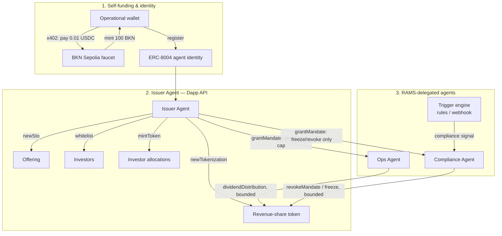

# RevPact

**A self-funding agent mesh that tokenizes recurring revenue, then hands out bounded, revocable authority to the agents that operate it.**

Built for the **Brickken Build with Brickken Programme — Agentic Challenge**.

> Working title. Rename freely — nothing below depends on the name.

## The pitch in one paragraph

A company's recurring revenue (subscription income, a SaaS contract, a royalty stream) is tokenized on Brickken as an investable asset. An **Issuer Agent** pays for its own onboarding over x402, registers an on-chain identity (ERC-8004), and runs the asset's full lifecycle. It then grants two other agents **scoped, capped, revocable mandates** under Brickken's Regulated Agent Mandate Standard (RAMS / ERC-8226): an **Ops Agent** that may only execute dividend payouts up to a pre-set cap, and a **Compliance Agent** that may only freeze or revoke access — nothing else. When a compliance signal fires, the Compliance Agent acts on its own, and the mandate boundary is what stops it (or anyone else) from doing more than that.

Nothing here is a human clicking buttons in a demo. Every step is an agent spending its own funds and acting inside an authority boundary it did not grant itself.

## Why this shape

Brickken's own framing of the Agentic Challenge is specific: *"the agent calls the API and also pays for the call."* That means three things have to actually happen on camera, not just be described:

1. An agent **funds itself** — pays 0.01 USDC over x402 to mint 100 BKN on Ethereum Sepolia, no human touching a faucet UI.
2. An agent's authority is **delegated, bounded, and revocable** via a RAMS mandate — not a shared private key, not a role flag in a database.
3. A **compliance action executes autonomously**, from a trigger, inside that mandate boundary — and is provably unable to exceed it.

Most public builds for this programme stop at step 1 (a single ERC-8004 registration) or get partway through step 2 (RAMS wiring present but not confirmed executing live). RevPact's scope is deliberately just those three things, done completely, wrapped in one coherent real-world story, rather than a wider feature list done partially.

## Architecture



Full sequence detail, mandate scopes, and the specific fields each agent is and isn't allowed to touch: see [`docs/architecture.md`](docs/architecture.md).

## Repo layout

```
docs/                 concept, architecture, build plan, known API issues
src/brickken/         Dapp API + Agentic API + x402 client wrappers
src/agents/           issuer / ops / compliance agent logic
src/rules/            compliance trigger engine
scripts/              wallet setup, x402 faucet funding
```

## Status

🚧 Pre-access scaffold. No Brickken API key or funded wallet yet — see [`docs/build-plan.md`](docs/build-plan.md) for the day-by-day sequence from here to submission. Method names and payload shapes in `src/brickken/` are seeded from patterns other participants reported publicly (see sources noted inline) and from ERC-8226 / x402 public material; **every one of them needs to be checked against the live [docs.brickken.com](https://docs.brickken.com) reference before first real call** — that verification pass is step 1 of the build plan.

## Judging alignment

| Criterion | How this build addresses it |
|---|---|
| Most innovative use case | Revenue-share tokenization isn't itself new, but a *mandate-bounded agent hierarchy operating it* — one agent that can only pay, one that can only kill — is a materially different pattern than "agent watches asset and reacts." |
| Most interesting / engaging concept | The demo's climax is a trigger the operator doesn't control, executed by an agent whose authority is cryptographically capped before the trigger ever fires. |
| Best technical execution & API integration | Closes the full agentic stack — x402 self-payment, ERC-8004 identity, RAMS delegate/execute/revoke, Dapp API lifecycle — rather than one or two pieces of it. |
| Highest real-world viability | "Bounded delegated authority + automatic compliance kill-switch" is the actual precondition institutions need before letting any agent near a cap table — this is the control story, not just the tokenization story. |

## AI disclosure

This project is being scaffolded and built with Claude's assistance (architecture, client code, docs). All Brickken integration, transaction execution, and verification will be run and checked by the project author against real Sepolia state before submission.
