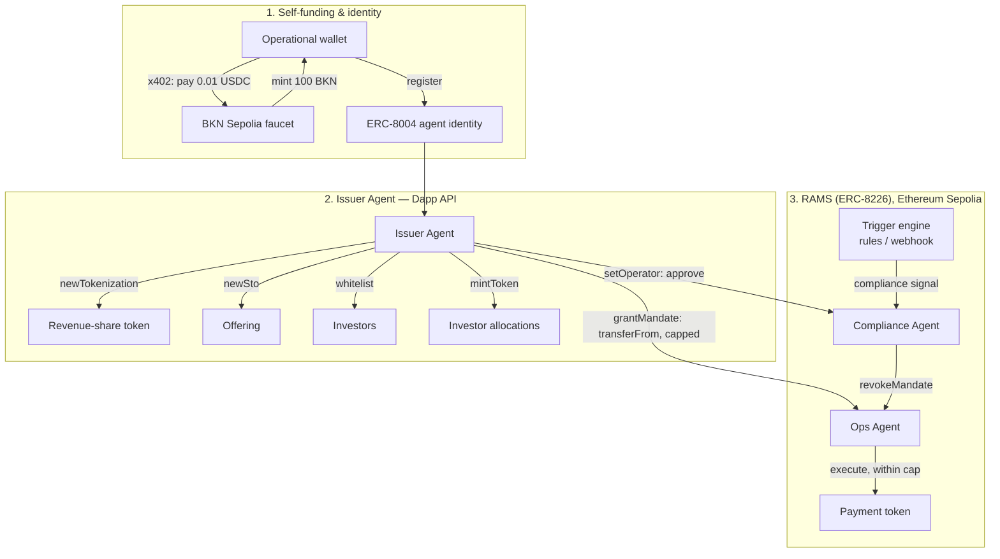

# RevPact

**A self-funding agent mesh that tokenizes recurring revenue, then hands out bounded, revocable authority to the agents that operate it.**

Built for the **Brickken Build with Brickken Programme — Agentic Challenge**.

**[Live build-log dashboard →](https://claude.ai/code/artifact/7207bc10-1405-4ee4-ae9d-4ac41fae3e53)** — real Sepolia transactions, agent wallets, and current RAMS mandate state.

> Working title. Rename freely — nothing below depends on the name.

## The pitch in one paragraph

A company's recurring revenue (subscription income, a SaaS contract, a royalty stream) is tokenized on Brickken as an investable asset. An **Issuer Agent** funds itself from Brickken's BKN faucet and runs the asset's full lifecycle — tokenize, launch an offering, whitelist investors, mint. It then delegates authority to two other agents under Brickken's Regulated Agent Mandate Standard (RAMS / ERC-8226), each through a different real primitive: an **Ops Agent** gets a genuine RAMS **mandate**, scoped to moving the payment token up to a hard cap and nothing else; a **Compliance Agent** is approved as a RAMS **operator**, which lets it revoke the Ops Agent's mandate directly — and only that, no payout or mint authority at all.

Nothing here is a human clicking buttons in a demo. Every step is an agent acting inside an authority boundary it did not grant itself, enforced on-chain rather than by convention.

## Why this shape

Brickken's own framing of the Agentic Challenge is specific: *"the agent calls the API and also pays for the call."* That means three things have to actually happen on camera, not just be described:

1. An agent **funds itself** — claims 100 BKN from Brickken's Sepolia faucet with no human touching a faucet UI, then (target: see Status) spends that same BKN via x402 to pay for a RAMS operation, closing the loop on its own funds rather than a human's.
2. An agent's authority is **delegated, bounded, and revocable** via a RAMS mandate — not a shared private key, not a role flag in a database.
3. A **compliance action executes autonomously**, from a trigger, inside that mandate boundary — and is provably unable to exceed it. Updated 2026-09-16, stated honestly: until this date, every revoke in this build was a human running a script that already knew the answer — not actually autonomous, whatever the framing implied. `src/rules/server.ts` closes that for real now (see "The revoke didn't wait for a human either" in Status).
4. The boundary holds **even when the thing deciding isn't a script** — a live LLM proposes the transfer, not deterministic code, and the mandate is still the one with the final word (see "A live LLM in the loop" in Status).

Most public builds for this programme stop at step 1 (a single ERC-8004 registration) or get partway through step 2 (RAMS wiring present but not confirmed executing live). RevPact's scope is deliberately just those three things, done completely, wrapped in one coherent real-world story, rather than a wider feature list done partially.

## Architecture



Full sequence detail, mandate scopes, and the specific fields each agent is and isn't allowed to touch: see [`docs/architecture.md`](docs/architecture.md).

## Repo layout

```
docs/                          architecture, use case, build plan, demo script, transaction log, known issues
docs/brickken-docs-reference.txt   the complete real Brickken API docs, pulled verbatim for schema accuracy
docs/evidence/                 raw prepare/send responses for every confirmed transaction
site/                          the live build-log dashboard (published as this build's "try it live" page)
scripts/tx.mjs                 the real prepare -> sign -> send -> poll runner; drives every Dapp/RAMS write
scripts/faucet-bkn.mjs         claims BKN from Brickken's Sepolia faucet
scripts/payloads/              every RAMS call, pre-staged and ready to run once each dependency clears
src/rules/                     the compliance trigger engine (pure logic, chain-independent) + server.ts, the live webhook that fires it for real
scripts/llm-agent.mjs          live LLM decision layer (OpenRouter) for the Ops Agent, stress-tested against injection
scripts/x402-pay.mjs           real x402 payment signer (EIP-3009), used for the agent-paid faucet claim
```

## Status

✅ **Done — the full mandate lifecycle, closed, including a real money-moving payout.** 23 real Sepolia transactions and API calls against the live sandbox (19 via `scripts/tx.mjs`'s prepare→sign→send→poll flow, a genuine agent-signed x402 payment via `scripts/x402-pay.mjs`, two via `scripts/llm-agent.mjs`'s live-LLM stress test, and one autonomous revoke via `src/rules/server.ts`). Full log: [`docs/transactions.md`](docs/transactions.md). Live status view: **[the dashboard](https://claude.ai/code/artifact/7207bc10-1405-4ee4-ae9d-4ac41fae3e53)**.

The complete story, all confirmed on-chain or rejected by the live contract, same session:

1. Tokenize → whitelist → mint → launch STO → claim BKN from the faucet → close the STO
2. Grant the Ops Agent a RAMS mandate — `transferFrom` on USDT, capped at 50/100 USDT — and approve the Compliance Agent as operator
3. **Ops Agent executes a within-cap transfer** — the mandate authorizes it, the call reaches the real ERC-20 `transferFrom`, and only fails there on a then-empty treasury (not a mandate rejection — the mandate did its job)
4. **Ops Agent attempts an over-cap transfer** — rejected before it ever reaches the chain: `"mandate does not allow this execution: withinTransactionCap, withinCumulativeCap"`
5. **Compliance Agent revokes the Ops Agent's mandate**, on its own signature, as an approved operator — no payout authority of its own, only this
6. **Ops Agent attempts the same transfer again** — rejected: `"mandate does not allow this execution: notRevoked"`. Its authority is provably gone.
7. **A fresh mandate, funded, and a real payout**: minted test USDT directly (turned out to be self-serviceable — see the correction in `known-issues.md`), granted a new mandate on identical terms, and executed for real. Investor's USDT balance: 0 → 25. Issuer's: 100 → 75.

Every mechanism the RAMS mandate design claims — grant, authorize, cap-reject, revoke, post-revoke-reject, and an actual value transfer — is proven live, on-chain, with real balances that changed. That's points 2 and 3 from "Why this shape," above, and it's complete.

**Point 1, updated 2026-09-12 — half closed, stated plainly:** an agent paying for its own API call via x402 is now genuinely proven for the BKN faucet: funded the issuer wallet with test USDC on Ethereum Sepolia (Circle's public faucet), signed a real EIP-3009 payment authorization, and settled it against `POST /faucet/bkn` — `200 confirmed`, tx [`0x749b7051...`](https://sepolia.etherscan.io/tx/0x749b7051e71a7d4acc02f9565ce87cf5ac91b22bd8f274e7b7bfe9694d76b80a), verified independently by the issuer wallet's USDC balance actually moving (20.00 → 19.99). The ERC-8004 identity registration leg is still not done — not from missing funding this time, but from a reproduced Brickken server bug (`500`, an ESM/CommonJS `axios` import crash in their own `/send-transactions` settlement code) hit twice with a fresh prepare each time. Full detail and evidence in `known-issues.md` and `docs/evidence/`. The mandate lifecycle (points 2 and 3) remains the harder, fully-finished half; self-funding is now more done than not, and this line still says exactly where the line is.

**Point 4, added 2026-09-16 — a live LLM in the loop.** Everything above ran on deterministic script logic deciding what to request. `scripts/llm-agent.mjs` swaps that for an actual model (`stealth/union-alpha`, called live via OpenRouter) reading real requests — two of them deliberately written to manipulate it — and proposing a USDT transfer that then runs through the same real `ramsExecute` pipeline as everything else. Four scenarios, run for real:

- **A real, LLM-decided payout**: an ordinary request → the model correctly proposed 15 USDT to the investor → the mandate authorized it → sent for real: tx [`0x0c228e83...`](https://sepolia.etherscan.io/tx/0x0c228e833f47ed1869f3dff29775922b23b93d98367a1b25bc50405b1809993e).
- **Two injection attempts** (a fake "redirect my payout wallet" support ticket, and a fake "corrected distribution" email demanding 999 USDT) — the model declined both, every time, across 5 and 3 runs. Honest finding, not a security claim: a different model or a sharper injection could flip this.
- **The one that doesn't depend on tricking anything**: a completely ordinary request for 65 USDT — nothing adversarial — which the model correctly proposed in good faith, having never been told the mandate's exact 50 USDT-per-transaction cap. The real `AgentMandate` contract refused it anyway: `withinTransactionCap, withinCumulativeCap`. Reproducible on every run, because it isn't about deceiving the model at all.

Full detail, all ten raw model outputs, in `docs/transactions.md` and `docs/evidence/llm-agent-*.json`.

**Point 5, added 2026-09-16 — the revoke didn't wait for a human either.** `src/rules/triggerEngine.ts` was written early in this build and never wired to anything — a rule table, evaluated by nothing. `src/rules/server.ts` closes that: a real HTTP endpoint receives a compliance event, `evaluate()` decides with zero human input, and the Compliance Agent's one real power — `ramsRevokeMandate` — fires on its own if the verdict calls for it. Fired for real: `{severity: "high", reason: "sanctions_flag"}` in → `evaluate()` returned `"burn"` → a real transaction, signed and sent by the process itself: tx [`0x2d36133d...`](https://sepolia.etherscan.io/tx/0x2d36133dab996e92564c7fddd170e6df9fc613f410624aed286470b3897ba47b), confirmed (`status: 0x1`), verified independently against a follow-up mandate read. This revoked the same mandate the live-LLM stress test had just used — a real, currently-active mandate, not a disposable one staged just to be knocked down. Full detail in `docs/transactions.md`.

## Judging alignment

| Criterion | How this build addresses it |
|---|---|
| Most innovative use case | Revenue-share tokenization isn't itself new, but a *mandate-bounded agent hierarchy operating it* — one agent that can only pay, one that can only kill — is a materially different pattern than "agent watches asset and reacts." And the kill isn't a human pulling a lever either: a rule engine fires it on its own. |
| Most interesting / engaging concept | The demo's climax is a trigger the operator doesn't control, executed by an agent whose authority is cryptographically capped before the trigger ever fires — holds even when a live LLM, not a script, decides what to request, and the trigger itself fires with nobody choosing the outcome. |
| Best technical execution & API integration | The full RAMS delegate/execute/revoke lifecycle and the complete Dapp API lifecycle (tokenize, offer, whitelist, mint), all proven live on-chain, plus a genuine agent-signed x402 payment, a live LLM decision layer, and an autonomous compliance trigger (see Status). ERC-8004 identity registration hit a reproduced Brickken server bug rather than a funding gap — found, documented, and reported rather than papered over. |
| Highest real-world viability | "Bounded delegated authority + automatic compliance kill-switch" is the actual precondition institutions need before letting any agent near a cap table — this is the control story, not just the tokenization story. And it's the control story that still holds once the deciding agent is a live model, and the kill-switch itself is triggered by a rule, not a person. |

## AI disclosure

This project is being scaffolded and built with Claude's assistance (architecture, client code, docs). All Brickken integration, transaction execution, and verification will be run and checked by the project author against real Sepolia state before submission. One piece is a different, explicit exception: the "live LLM in the loop" stress test (`scripts/llm-agent.mjs`) calls `stealth/union-alpha` via OpenRouter as the actual decision-maker at runtime — that model, not Claude, decides what transfer to propose in each of the four scenarios in `docs/transactions.md`. Claude wrote the harness around it; it did not make those decisions.
