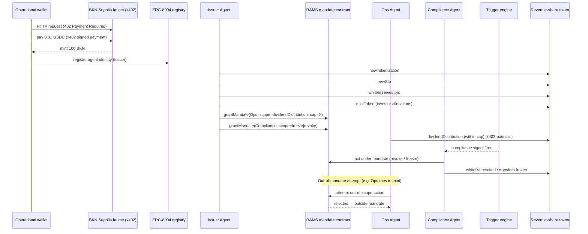

# Architecture

## Agents and their authority boundaries

### Operational wallet (bootstrap)
Not an "agent" with logic of its own — the funding source. Holds testnet ETH for gas plus whatever USDC/EURC it needs for x402 calls. Everything downstream is paid for from here or from wallets this one funds.

### Issuer Agent
- Registers an ERC-8004 identity for itself.
- Runs the asset lifecycle over the Dapp API: `newTokenization` → `newSto` → `whitelist` → `mintToken` (to investors) → later, `dividendDistribution` for the first payout round, to prove it *can* do the full thing end to end before it delegates anything away.
- Issues two RAMS mandates (see below), each to a distinct wallet/identity it does not otherwise control day-to-day.
- Holds mint/burn authority itself — this is deliberately *not* delegated to either subordinate agent. Only payout execution and freeze/revoke are delegated.

### Ops Agent (RAMS-mandated)
- Mandate scope: **may call `dividendDistribution` (and its required `approve`) for this token only, up to a cumulative cap, within a time window.**
- Cannot mint, burn, whitelist, or touch any other token.
- Demo proof point: attempt a payout that exceeds the mandate cap and show it rejected at the mandate layer, not just at the application layer — i.e. the chain/contract refuses it, not just our own client-side check.

### Compliance Agent (RAMS-mandated)
- Mandate scope: **may call freeze / `revokeMandate` (or the equivalent whitelist-revocation path) for this token only.** No mint, no burn, no payout authority.
- Driven by the trigger engine (`src/rules/`), not by a human pressing a button in the demo. Feed it something that looks like a real signal — a webhook payload, a simple threshold on an off-chain data value — so the "autonomous" claim is literal.
- Demo proof point: same shape as the Ops Agent's — show the Compliance Agent attempting something outside its mandate (e.g. a mint) and being refused, to make the boundary visible rather than asserted.

## Full sequence

## Trigger engine

Kept intentionally simple so it's demonstrably real rather than theatrical:
- A small HTTP endpoint that accepts a signed/structured "compliance event" payload (severity, reason code, target investor/token).
- A rule table maps `(severity, reason)` → action (`freeze` vs `revoke`) and which mandate covers it.
- The Compliance Agent polls or is pushed this event and acts without any other agent or the operator being involved in the call.

This can start as a script you POST to locally and graduate to something pulling from a real external signal (e.g. a sanctions-list check, a KYC-expiry timestamp) if time allows — the trigger's *source* matters less than the fact that the agent, not the operator, decides and executes.

## Open verification items (do before first real call)

These are called out because they were inferred from public material, not read directly from `docs.brickken.com` (fetching it was blocked in the scaffolding environment):
- Exact `/prepare-transactions` payload shape per method (field names, required vs optional) — verify each against the live API reference.
- Exact RAMS endpoint/method names for grant / execute-under-mandate / revoke / extend (ERC-8226 names these `grantMandate`, `revokeMandate`, `extendMandate` at the contract level; confirm the Brickken API's method names match).
- Exact x402 faucet endpoint and required headers/payment payload for the "0.01 USDC → 100 BKN" flow.
- Whether CLI or MCP is the more direct path for the x402-metered calls versus hitting the Agentic API HTTP endpoints directly with a signed payment header.
- The `approve` non-zero→non-zero allowance quirk and the `mintToken` treasury-address restriction, both reported by other participants in the programme's Discord — confirm current behavior before relying on either being fixed.
