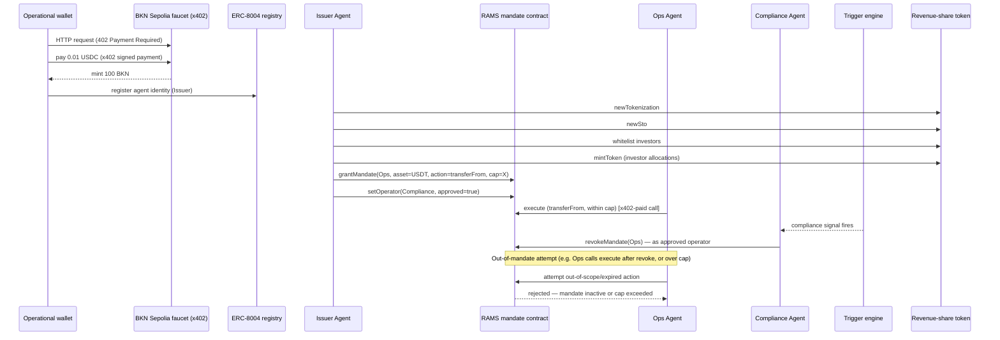

# Architecture

## Agents and their authority boundaries

### Operational wallet (bootstrap)
Not an "agent" with logic of its own — the funding source. Holds testnet ETH for gas plus whatever USDC/EURC it needs for x402 calls. Everything downstream is paid for from here or from wallets this one funds.

### Issuer Agent
- Registers an ERC-8004 identity for itself.
- Runs the asset lifecycle over the Dapp API: `newTokenization` → `newSto` → `whitelist` → `mintToken` (to investors) → later, `dividendDistribution` for the first payout round, to prove it *can* do the full thing end to end before it delegates anything away.
- Issues two RAMS mandates (see below), each to a distinct wallet/identity it does not otherwise control day-to-day.
- Holds mint/burn authority itself — this is deliberately *not* delegated to either subordinate agent. Only payout execution (a RAMS mandate) and revoke authority (a RAMS operator approval) are delegated; freeze is registry-admin-only and out of scope unless Brickken grants it.

### Ops Agent (RAMS-mandated)
- Mandate scope (as actually implemented, see below): **may move up to a capped amount of the payment token (USDT) from the issuer's treasury via `transferFrom`, standing in for a dividend payout.**
- Cannot mint, burn, whitelist, or touch any other asset.
- Demo proof point: attempt a payout that exceeds the mandate cap and show it rejected at the mandate layer, not just at the application layer — i.e. the chain/contract refuses it, not just our own client-side check.

**Scoping note (confirmed against the live RAMS API, 2026-09-09):** Brickken's own `dividendDistribution` is a custom contract method, not a plain ERC-20 `transferFrom`. Routing it through RAMS would require registering its selector on the AgentExecutor via `ramsSetExecutorAction`, with the correct ABI word index for the amount — and that call must come from the *executor owner*, which may be Brickken on our dedicated sandbox executor rather than us. Rather than risk that dependency inside the build window, the Ops Agent's mandate uses RAMS's documented ERC-20 helper mode instead (`asset`/`from`/`to`/`amount` → the API encodes `transferFrom`), moving the payment token itself under a real, enforced cap. This is a deliberate scope call, not an oversight — it demonstrates the identical mechanism (capped, delegated, revocable authority moving real value) without the extra dependency. If Brickken confirms we own the executor, upgrading to a native `dividendDistribution` selector is a same-day follow-up, tracked in `docs/build-plan.md`.

### Compliance Agent (RAMS **operator**, not a mandate)
- **Correction (2026-09-09, confirmed against the live API):** freeze and revoke are not modeled as a "mandate" in RAMS the way payout authority is. They're two distinct primitives:
  - `ramsRevokeMandate` — callable by the **principal**, or by any wallet the principal has approved as an **operator** via `ramsSetOperator`. This is exactly a delegated revoke authority, so the Compliance Agent's real scope is: **the issuer (principal) approves the Compliance Agent as a RAMS operator**, which then lets it directly revoke the Ops Agent's mandate on its own signature — no separate "grant" step needed beyond that operator approval.
  - `ramsFreezeAgent` — requires **`ENFORCER_ROLE`** on the AgentMandate registry, a registry-admin role, not something a principal can delegate via a mandate or operator approval. On the shared Sandbox this role is Brickken's to grant. Treated as a **stretch addition**: ask Brickken for it if there's time; the core demo does not depend on it.
- No mint, no burn, no payout authority — operator approval only reaches `revokeMandate`/`extendMandate`, nothing else.
- Driven by the trigger engine (`src/rules/`), not by a human pressing a button in the demo. Feed it something that looks like a real signal — a webhook payload, a simple threshold on an off-chain data value — so the "autonomous" claim is literal.
- Demo proof point: same shape as the Ops Agent's — show the Compliance Agent attempting something outside its reach (e.g. `ramsExecute`, which only the mandate's own `agent` can call) and being refused, to make the boundary visible rather than asserted.

## Full sequence

## Trigger engine

Kept intentionally simple so it's demonstrably real rather than theatrical:
- A small HTTP endpoint that accepts a signed/structured "compliance event" payload (severity, reason code, target investor/token).
- A rule table maps `(severity, reason)` → action (`freeze` vs `revoke`) and which mandate covers it.
- The Compliance Agent polls or is pushed this event and acts without any other agent or the operator being involved in the call.

This can start as a script you POST to locally and graduate to something pulling from a real external signal (e.g. a sanctions-list check, a KYC-expiry timestamp) if time allows — the trigger's *source* matters less than the fact that the agent, not the operator, decides and executes.

## Status (2026-09-10)

Everything in this document is now verified against the live sandbox, not inferred — see `docs/transactions.md` for the full tx-hash-backed log. As of this update:

- **Mandate granted and confirmed on-chain**: the Ops Agent (`0x5F7d…8B3dC`) holds a real RAMS mandate scoped to `transferFrom` on USDT, capped at 50 USDT/tx and 100 USDT cumulative.
- **Operator approved and confirmed on-chain**: the Compliance Agent (`0x0F19…96D85`) can call `revokeMandate` on that mandate directly.
- **Cap enforcement verified live**: `GET /rams/can-execute` — the mandate contract's own logic, not an app-side check — returns `allowed: true` for a 25 USDT request and `allowed: false` (both `withinTransactionCap` and `withinCumulativeCap` false) for a 999 USDT request, against the actual granted mandate.
- **Still open**: an actual `execute` (moving real value) needs (1) the issuer to hold real USDT — 0 today, blocked on Brickken funding it — and (2) the Ops and Compliance wallets funded with a little Sepolia ETH to sign their own steps. Both tracked in `known-issues.md` / `docs/build-plan.md`.
